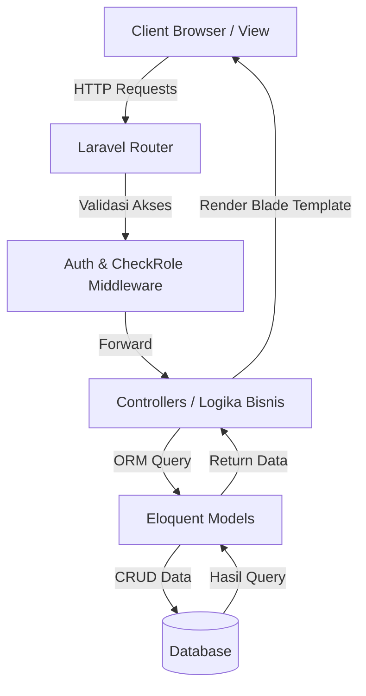
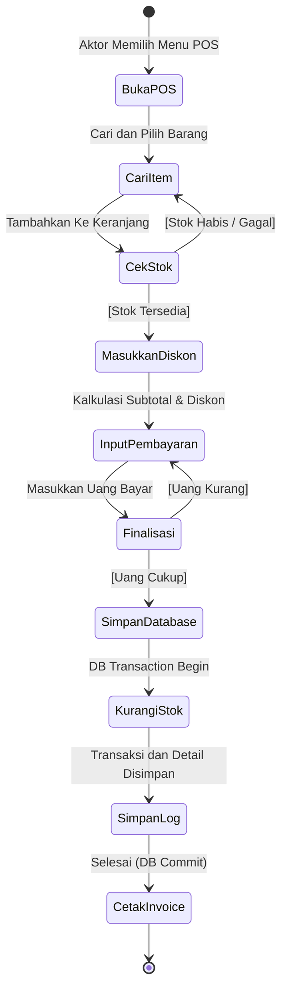
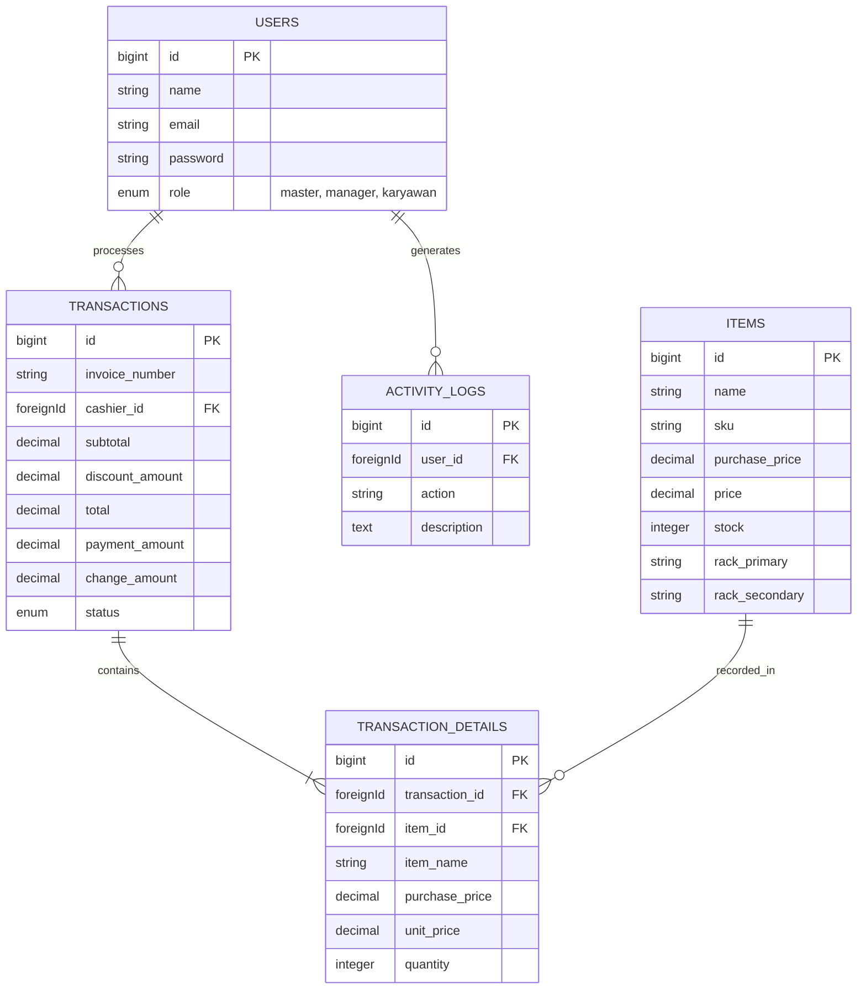

# Software Project Blueprint (SPB) - CargoMind

## 1. Pendahuluan

### a. Latar Belakang
Dalam era digital, proses manajemen inventaris dan operasional penjualan toko yang dilakukan secara konvensional seringkali memicu permasalahan kompleks seperti ketidaksesuaian stok (human error), pemrosesan penjualan yang lambat, dan kesulitan dalam menyusun laporan keuangan yang akurat. Untuk mengatasi berbagai tantangan ini, dibutuhkan sebuah solusi perangkat lunak terintegrasi yang mampu mendigitalisasi proses manajemen toko dan pergudangan secara komprehensif.

### b. Tujuan Pengembangan Sistem
Tujuan utama pengembangan CargoMind adalah untuk menyediakan sistem manajemen toko dan gudang (*Store & Warehouse Management System*) yang tangguh (robust) guna merampingkan pelacakan inventaris, memfasilitasi pemrosesan penjualan (*Point of Sale*) dengan cepat, dan menyederhanakan penyusunan laporan keuangan untuk bisnis skala menengah.

### c. Deskripsi Singkat Sistem
**CargoMind** adalah aplikasi berbasis web dengan arsitektur Monolitik menggunakan framework Laravel. Sistem ini menyediakan lingkungan operasional yang aman dengan fitur-fitur seperti *Dashboard* analitik, *Inventory Management* tingkat lanjut (termasuk pelacakan rak penyimpanan utama dan sekunder), fitur POS (kasir) yang interaktif, sistem pelaporan terpadu, serta fitur eksklusif "God Mode" untuk rektifikasi data transaksi tingkat administrator.

---

## 2. Kebutuhan Sistem (System Requirements)

### a. Identifikasi Stakeholder & User
- **Stakeholders Utama:** Pemilik Usaha, Manajer Toko, Karyawan Operasional.
- **Daftar User (Berdasarkan Role):**
  1. **Master:** Admin tertinggi. Memiliki akses penuh ke semua modul, konfigurasi aplikasi, manajemen user, serta akses ke fitur eksklusif "God Mode" (edit/hapus transaksi dengan koreksi stok otomatis).
  2. **Manager:** Mengelola keseluruhan inventaris, akses ke sistem POS, dan berhak melihat keseluruhan laporan pendapatan (Dashboard & Revenue reports).
  3. **Karyawan (Staff):** Menjalankan operasional harian seperti melihat/mengedit data inventaris dan melakukan proses penjualan via POS. Tidak memiliki akses ke laporan finansial maupun setelan sistem.

### b. Functional Requirements
- **FR-01:** Sistem harus menyediakan mekanisme Autentikasi dan *Role-Based Access Control* (RBAC) untuk mengelola batasan hak akses antar pengguna.
- **FR-02:** Sistem harus menyediakan fungsionalitas CRUD Inventaris yang mencakup informasi harga beli, harga jual, lokasi rak (primer/sekunder), foto barang, serta pelacakan stok.
- **FR-03:** Sistem harus memiliki modul *Point of Sale* (POS) yang memungkinkan penambahan item ke dalam *cart* dengan validasi stok dinamis, penerapan diskon, serta pembuatan dan cetak *Invoice* (Struk Thermal maupun PDF A5).
- **FR-04:** Sistem (khusus untuk role Master) harus memiliki fitur *God Mode* yang memungkinkan modifikasi atau penghapusan transaksi dan secara otomatis melakukan sinkronisasi ulang *inventory stock*.
- **FR-05:** Sistem harus mampu memproses dan menampilkan *Revenue Reports* (laporan pendapatan) dan memfasilitasi *export* data ke format Excel (`.xlsx`).
- **FR-06:** Sistem harus mencatat setiap *Activity Log* pengguna saat masuk maupun saat melakukan transaksi.

### c. Use Case Diagram

```mermaid
usecaseDiagram
    actor Master as "Master"
    actor Manager as "Manager"
    actor Karyawan as "Karyawan"

    usecase UC1 as "Melakukan Transaksi POS"
    usecase UC2 as "Manajemen Inventaris"
    usecase UC3 as "Melihat Dashboard"
    usecase UC4 as "Melihat Laporan Pendapatan"
    usecase UC5 as "Manajemen Pengguna"
    usecase UC6 as "Akses God Mode"

    Karyawan --> UC1
    Karyawan --> UC2

    Manager --> UC1
    Manager --> UC2
    Manager --> UC3
    Manager --> UC4

    Master --> UC1
    Master --> UC2
    Master --> UC3
    Master --> UC4
    Master --> UC5
    Master --> UC6
```

### d. Deskripsi Use Case (Use Case Utama: Transaksi POS)
- **Nama Use Case:** Melakukan Transaksi POS
- **Aktor Utama:** Karyawan, Manager, Master
- **Kondisi Awal (Precondition):** Pengguna telah berhasil *login* dan memiliki setidaknya satu barang aktif di database dengan stok lebih dari 0.
- **Alur Utama (Main Flow):**
  1. Pengguna membuka halaman *Point of Sale* (POS).
  2. Pengguna mencari dan menambahkan item pesanan ke dalam *cart* (keranjang).
  3. Sistem memvalidasi ketersediaan stok barang secara *real-time* (di frontend dan backend).
  4. Pengguna menambahkan catatan diskon transaksi (opsional).
  5. Pengguna memasukkan total pembayaran (*Payment Amount*) dari pelanggan.
  6. Sistem memproses pembayaran, mengkalkulasi kembalian (*Change Amount*).
  7. Sistem mengurangi ketersediaan stok (`items.stock`) dalam *Database Transaction* untuk menjamin integritas data.
  8. Sistem menyimpan riwayat `transactions`, `transaction_details`, dan mencatat `activity_logs`.
- **Kondisi Akhir (Postcondition):** Sebuah nomor invoice unik dihasilkan dan stok di gudang berkurang sesuai kuantitas yang terjual.

### e. Non-Functional Requirements
- **NFR-01 (Security):** Otentikasi berbasis *session* bawaan Laravel yang diamankan oleh *middleware* (`CheckRole`) dan hash algoritma untuk enkripsi password.
- **NFR-02 (Reliability/Integritas):** Seluruh proses penyimpanan di database saat transaksi harus dibungkus dalam blok *Database Transaction* agar tidak terjadi inkonsistensi stok bila ada kegagalan proses di tengah jalan.
- **NFR-03 (Usability & Responsiveness):** Modul interaksi tinggi seperti POS menggunakan eksekusi AJAX/JS sehingga proses penambahan *cart* tidak memerlukan pemuatan ulang (*full-page reload*).
- **NFR-04 (Traceability):** Audit trail untuk operasional diwujudkan dengan *Activity Log* yang tersentralisasi.

---

## 3. Desain Sistem (System Design)

### a. Arsitektur Sistem
CargoMind dibangun menggunakan arsitektur **Client-Server Monolitik** berlandaskan pola perancangan perangkat lunak **MVC (Model-View-Controller)**.
- **Sisi Klien (View):** Menggunakan *Blade Templates* dipadukan dengan HTML/CSS murni dan *Vanilla JavaScript*. Melayani presentasi UI kepada pengguna serta interaksi asinkron (AJAX) di frontend POS.
- **Server Aplikasi (Controller):** Menggunakan Laravel. Terdiri dari *Router* (`routes/web.php`) yang meneruskan setiap *request* HTTP (GET/POST/PUT/DELETE) ke *Controller* yang bersangkutan setelah melewati filter keamanan *Middleware* (*Auth* dan *CheckRole*).
- **Lapisan Data (Model):** Menggunakan **Eloquent ORM** dari Laravel untuk menjalankan kueri yang aman ke RDBMS (SQLite/MySQL/PostgreSQL).



### b. Activity Diagram (Alur Transaksi POS)



### c. Database Design (ERD)



### d. High Fidelity UI Design
*(Mohon paste screenshot High Fidelity UI / Figma Design / Screenshot aktual dari aplikasi CargoMind disini)*.
- **Gambar 1:** Screenshot Dashboard Utama
- **Gambar 2:** Screenshot Halaman Point of Sale (POS)
- **Gambar 3:** Screenshot Halaman Master Item/Inventaris

---

## 4. Repository Tim (Performance Evidence)

*(Bagian ini perlu diisi sesuai dengan data kelompok mahasiswa secara spesifik)*

**a. Link Git Repository**
`https://github.com/[Username]/CargoMind`

**b. Screenshot repository**
*(Paste screenshot dari halaman depan GitHub repository Anda, memperlihatkan code, branch dan file list)*

**c. Struktur branch**
- `main` / `master` : Branch utama yang menyimpan source code final (production-ready).
- `dev` : (Opsional) Branch untuk tahap testing dan development.
- `feature/*` : (Opsional) Branch yang digunakan tiap anggota tim jika sedang mengerjakan modul yang berbeda (contoh: `feature/pos-system`, `feature/export-excel`).

**d. Commit Activity**
**i. Screenshot / ringkasan kontribusi anggota**
*(Paste screenshot dari halaman tab `Insights -> Contributors` pada GitHub).*

**ii. Penjelasan singkat aktivitas tim**
Dalam pengembangan sistem CargoMind, seluruh anggota secara teratur berkontribusi menyusun kode program dan saling mengevaluasi melalui proses *Code Review* dan pembuatan fitur di modul tertentu, contohnya: Anggota A mengerjakan sisi *View (Blade)*, Anggota B mengatur konfigurasi routing dan struktur Database (Migrasi), lalu Anggota C fokus pada implementasi fitur transaksi (POS Controller).

---
**Catatan:** Dokumen ini siap untuk di-export/konversi menjadi PDF. Mohon lengkapi halaman **Cover** dengan nama tim, nama anggota, peran, NIM, serta sisipkan gambar / screenshot sesuai instruksi sebelum pengumpulan.
