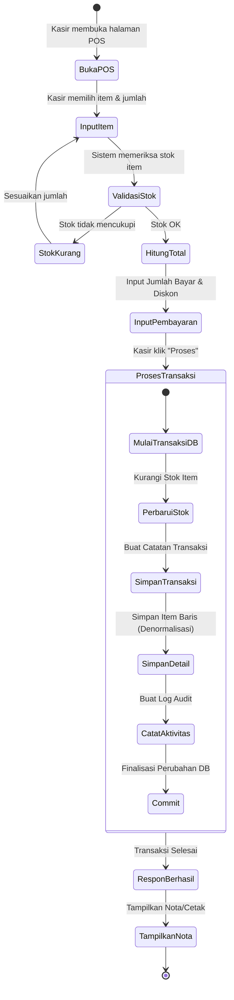
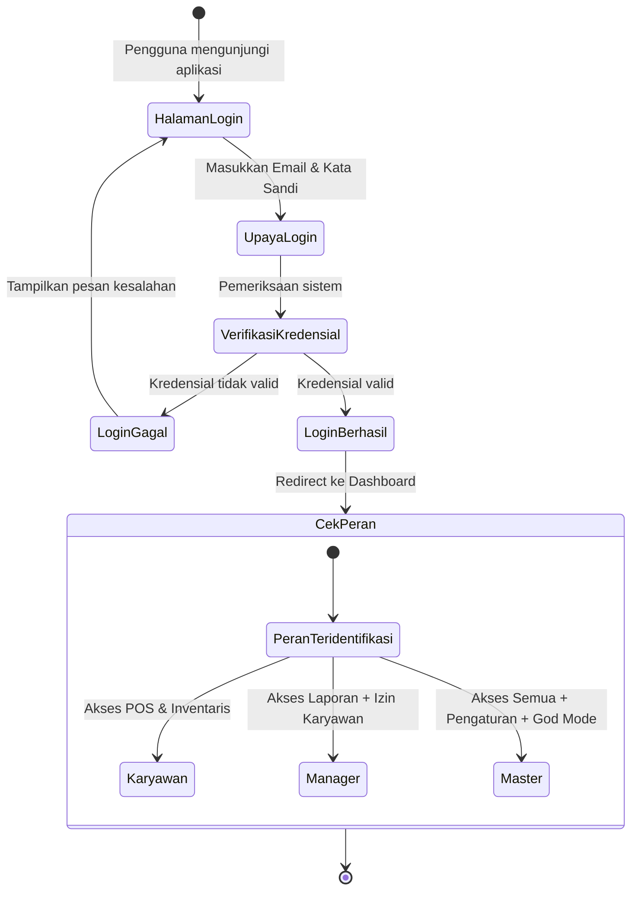
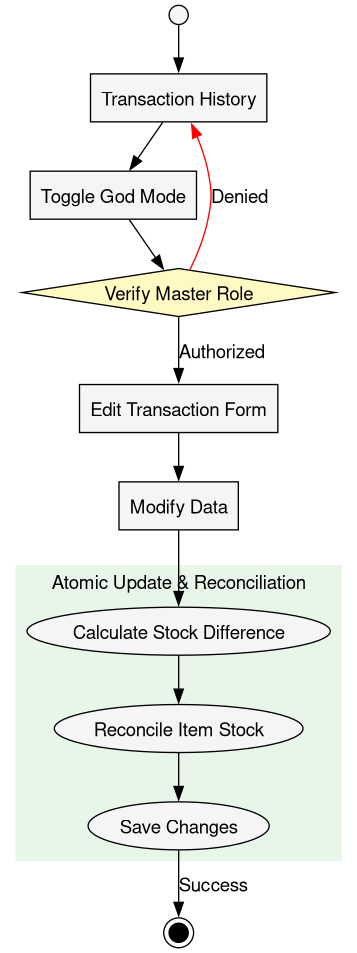
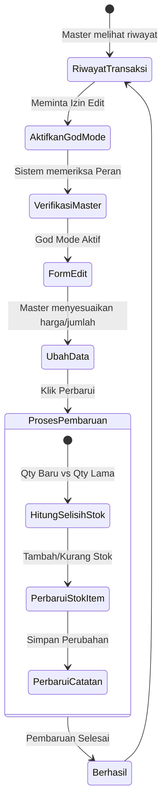

# Diagram Aktivitas (Activity Diagrams)

Dokumen ini merepresentasikan alur proses untuk kasus penggunaan (use case) paling signifikan dalam sistem CargoMind.

## 1. Proses Transaksi Penjualan (POS)

Transaksi penjualan adalah proses yang paling kompleks, melibatkan validasi stok dan operasi database atomik.

## 2. Alur Autentikasi dan Otorisasi
Memastikan bahwa hanya pengguna yang berwenang yang dapat mengakses bagian tertentu dari sistem berdasarkan peran yang diberikan.

## 3. Master God Mode (Pengeditan Transaksi)

Alur khusus untuk pengguna 'Master' untuk memperbaiki kesalahan transaksi sambil menjaga integritas stok.

