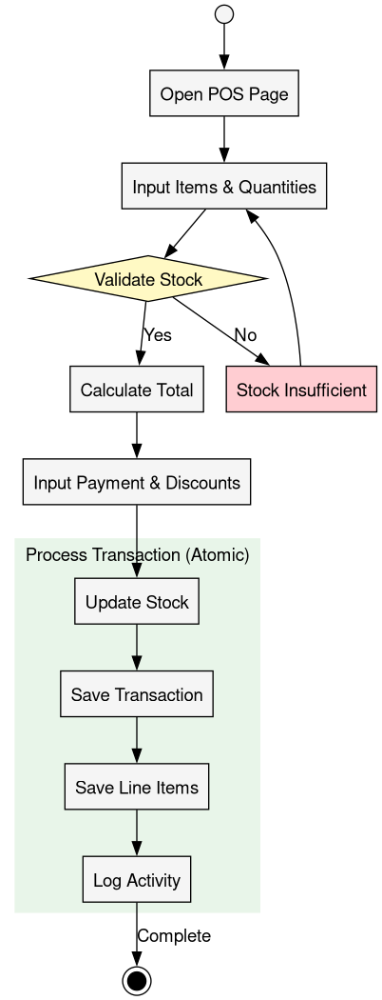
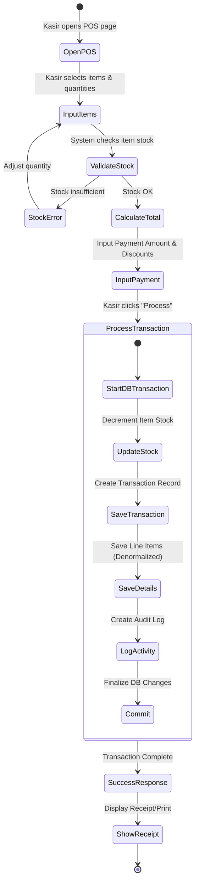
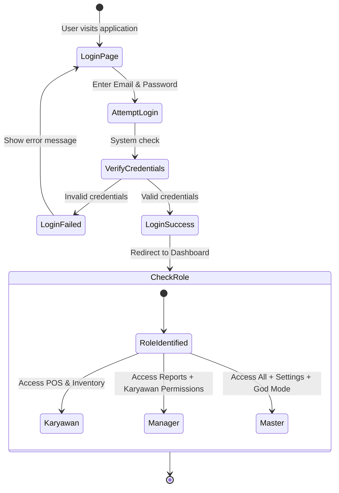
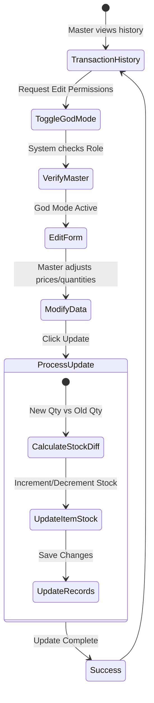

# Activity Diagrams

This document represents the process flows for the most significant use cases in the CargoMind system.

## 1. Sales Transaction (POS) Process

The sales transaction is the most complex process, involving stock validation and atomic database operations.

## 2. Authentication and Authorization Flow
Ensures that only authorized users can access specific parts of the system based on their assigned roles.

## 3. Master God Mode (Transaction Editing)
A specialized flow for the 'Master' user to correct transaction mistakes while maintaining stock integrity.

