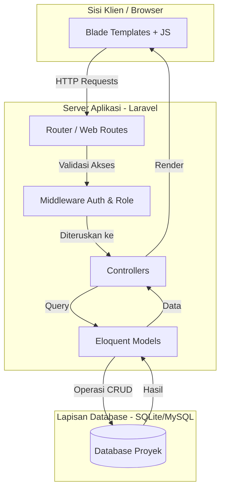

# Arsitektur Sistem

Dokumen ini menjelaskan desain arsitektural aplikasi CargoMind.

## 1. Ikhtisar (Overview)
CargoMind dibangun menggunakan **Arsitektur Client-Server Monolitik** berdasarkan pola desain **Model-View-Controller (MVC)**. Aplikasi ini memanfaatkan kerangka kerja (framework) Laravel untuk menyediakan lingkungan yang aman, terukur, dan mudah dipelihara untuk manajemen inventaris dan penjualan.

## 2. Diagram Arsitektur

## 3. Komponen Detail

### A. Sisi Klien (The "View")
Lapisan klien ditangani oleh **Blade Templating Engine**. 
- Berkomunikasi dengan server melalui permintaan HTTP standar (GET, POST, PUT, DELETE).
- Interaksi sisi klien (seperti sistem POS) menggunakan JavaScript/AJAX untuk memberikan pengalaman yang lancar tanpa memuat ulang halaman penuh untuk setiap item yang ditambahkan ke keranjang.

### B. Server Aplikasi (The "Controller")
Laravel berfungsi sebagai mesin inti aplikasi:
- **Routing:** Semua permintaan yang masuk diarahkan ke pengontrol tertentu melalui `routes/web.php`.
- **Middleware:** Lapisan keamanan yang memastikan hanya pengguna terotentikasi yang dapat mengakses sistem. Middleware ini juga memeriksa peran tertentu (`master`, `manager`, `karyawan`) untuk membatasi akses ke fitur sensitif seperti laporan atau pengaturan.
- **Controllers:** Menampung logika bisnis. Pengontrol menerima input dari pengguna, berinteraksi dengan model, dan menentukan apa yang akan dilihat pengguna selanjutnya.

### C. Lapisan Data (The "Model")
- **Eloquent ORM:** Menyediakan sintaks ekspresif untuk interaksi database.
- **Database:** Sistem dirancang untuk bekerja dengan **SQLite** untuk penerapan ringan atau **MySQL/PostgreSQL** untuk operasi skala yang lebih besar.
- **Migrations:** Memastikan kontrol versi untuk skema database, memudahkan penerapan dan sinkronisasi di berbagai lingkungan.

## 4. Arsitektur Keamanan
- **Autentikasi:** Autentikasi berbasis sesi menggunakan guard bawaan Laravel.
- **Role-Based Access Control (RBAC):** Middleware khusus (`CheckRole`) memastikan bahwa pengguna hanya dapat melakukan tindakan yang diizinkan untuk level spesifik mereka (misal: hanya 'Master' yang dapat menghapus transaksi atau mengelola pengguna).
- **Integritas Data:** Transaksi database digunakan dalam proses kritis (seperti penjualan) untuk memastikan bahwa seluruh proses berhasil (stok diperbarui + transaksi disimpan) atau tidak terjadi apa-apa sama sekali, mencegah kerusakan data.
