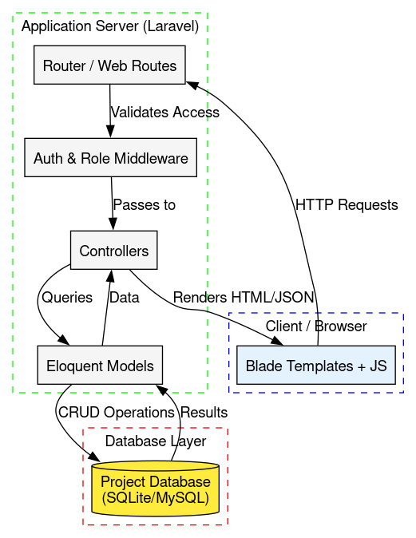
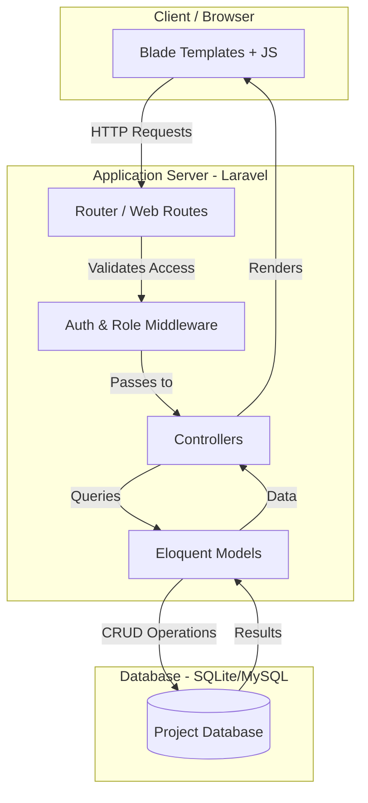

# System Architecture

This document describes the architectural design of the CargoMind application.

## 1. Overview
CargoMind is built using a **Monolithic Client-Server Architecture** based on the **Model-View-Controller (MVC)** design pattern. It utilizes the Laravel framework to provide a secure, scalable, and maintainable environment for inventory and sales management.

## 2. Architecture Diagram

## 3. Detailed Components

### A. Client Side (The "View")
The client layer is handled by **Blade Templating Engine**. 
- It communicates with the server via standard HTTP requests (GET, POST, PUT, DELETE).
- Client-side interactions (like the POS system) utilize JavaScript/AJAX to provide a seamless experience without full page reloads for every item added to the cart.

### B. Application Server (The "Controller")
Laravel serves as the core application engine:
- **Routing:** All incoming requests are routed to specific controllers via `routes/web.php`.
- **Middleware:** A security layer that ensures only authenticated users can access the system. It also checks for specific roles (`master`, `manager`, `karyawan`) to restrict access to sensitive features like reports or settings.
- **Controllers:** House the business logic. They receive input from the user, interact with models, and determine what the user sees next.

### C. Data Layer (The "Model")
- **Eloquent ORM:** Provides an expressive syntax for database interaction.
- **Database:** The system is designed to work with **SQLite** for lightweight deployments or **MySQL/PostgreSQL** for larger scale operations.
- **Migrations:** Ensure version control for the database schema, making it easy to deploy and sync across environments.

## 4. Security Architecture
- **Authentication:** Session-based authentication using Laravel's built-in guards.
- **Role-Based Access Control (RBAC):** Custom middleware (`CheckRole`) ensures that users can only perform actions authorized for their specific level (e.g., only 'Master' can delete transactions or manage users).
- **Data Integrity:** Database transactions are used in critical processes (like sales) to ensure that either the entire process succeeds (stock updated + transaction saved) or nothing happens at all, preventing data corruption.
