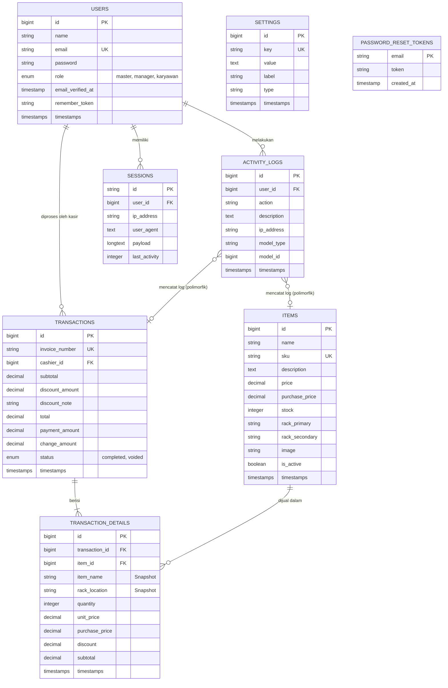

# Diagram Hubungan Entitas Database (ERD)

Dokumen ini menjelaskan struktur database untuk proyek CargoMind.

## Diagram Mermaid

## Deskripsi Entitas

### USERS
Menyimpan data pengguna aplikasi dan peran mereka. Peran meliputi `master` (pemilik), `manager`, dan `karyawan`.

### ITEMS
Berisi item inventaris, termasuk harga (`price` dan `purchase_price`), level stok, dan lokasi penyimpanan fisik (`rack_primary`, `rack_secondary`).

### TRANSACTIONS
Mencatat transaksi penjualan. Setiap transaksi terhubung ke `cashier_id` (User) dan mencakup total finansial serta status.

### TRANSACTION_DETAILS
Menyimpan item baris untuk setiap transaksi. Tabel ini melakukan denormalisasi data seperti `item_name` dan `purchase_price` pada saat penjualan untuk memastikan akurasi historis.

### ACTIVITY_LOGS
Jejak audit untuk tindakan sistem. Menggunakan `model_type` dan `model_id` untuk pelacakan polimorfik terhadap perubahan pada item, transaksi, dll.

### SETTINGS
Penyimpanan kunci-nilai (key-value) untuk konfigurasi aplikasi dan metadata.

### Tabel Sistem
*   **SESSIONS**: Mengelola status sesi pengguna.
*   **PASSWORD_RESET_TOKENS**: Menangani pemulihan kata sandi.
