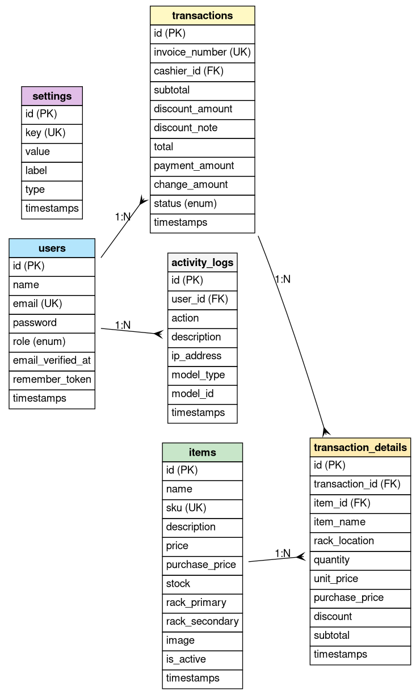
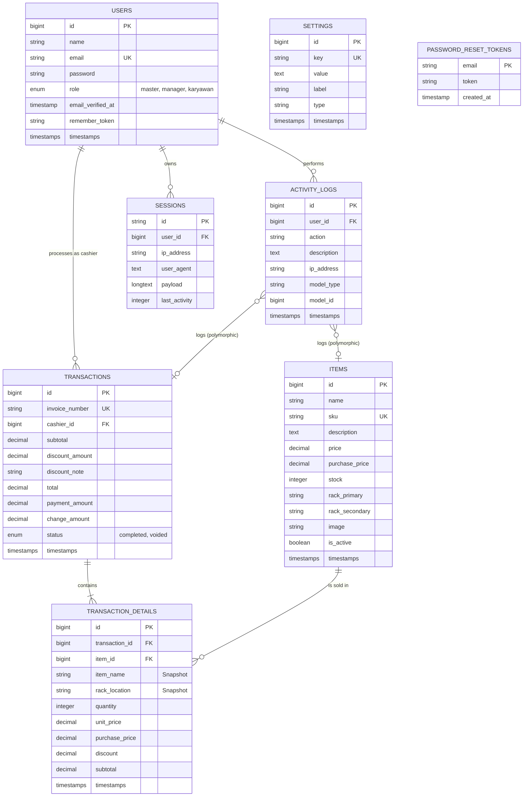

# Database Entity Relationship Diagram (ERD)

This document describes the database structure for the CargoMind project.

## Mermaid Diagram

## Entity Descriptions

### USERS
Stores application users and their roles. Roles include `master` (owner), `manager`, and `karyawan` (staff).

### ITEMS
Contains inventory items, including their pricing (`price` and `purchase_price`), stock levels, and physical storage locations (`rack_primary`, `rack_secondary`).

### TRANSACTIONS
Records sales transactions. Each transaction is linked to a `cashier_id` (User) and includes financial totals and status.

### TRANSACTION_DETAILS
Stores line items for each transaction. It denormalizes data like `item_name` and `purchase_price` at the time of sale to ensure historical accuracy.

### ACTIVITY_LOGS
Audit trail for system actions. Uses `model_type` and `model_id` for polymorphic tracking of changes to items, transactions, etc.

### SETTINGS
Key-value store for application configuration and metadata.

### System Tables
*   **SESSIONS**: Manages user session state.
*   **PASSWORD_RESET_TOKENS**: Handles password recovery.
